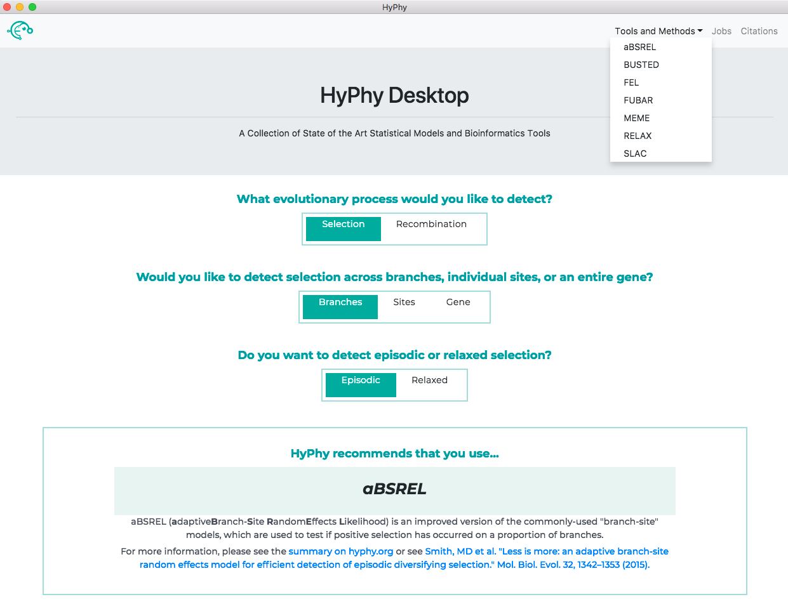
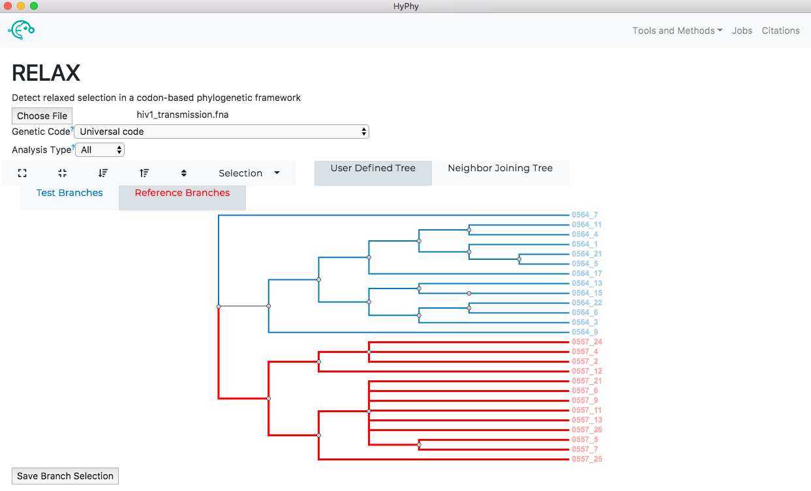
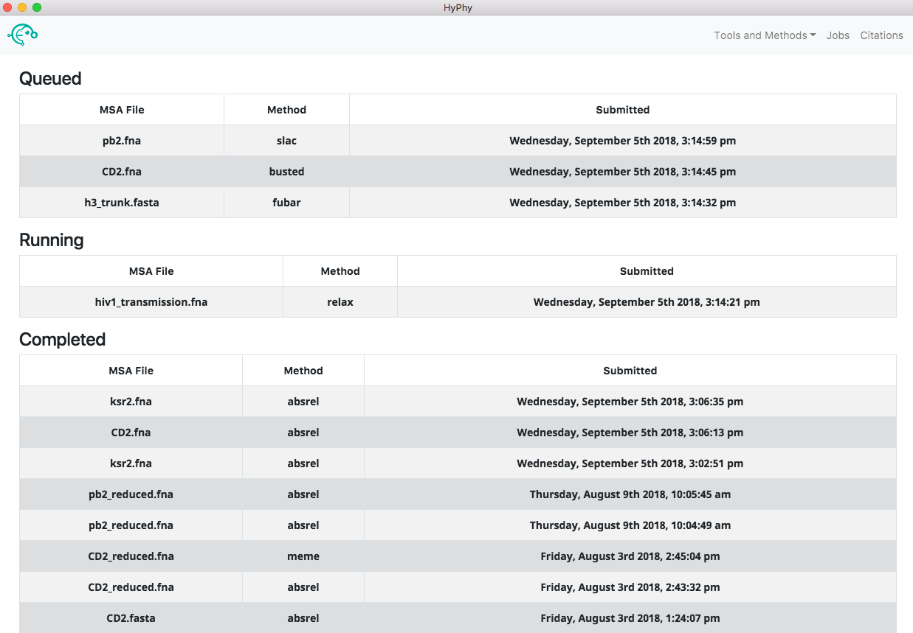

# HyPhy-GUI

[](https://travis-ci.org/veg/hyphy-gui)
[](https://opensource.org/licenses/MIT)

[DOWNLOAD APP](https://github.com/veg/hyphy-gui/releases)

[TUTORIAL](http://hyphy.org/tutorials/current-release-tutorial_gui/)

### Graphical User Interface Desktop Application for [HyPhy](https://github.com/veg/hyphy)

Collection of methods for interrogating sequence alignments for imprints of natural selection:


Same intuitive user interface for submitting jobs familiar to users of [datamonkey](datamonkey.org):


Provides the ability to queue multiple jobs, monitor the status of running jobs and vizualize results of completed jobs using the [hyphy-vision](https://github.com/veg/hyphy-vision) package:


## Development

Requirements:

- `make`
- `cmake`
- `yarn`

After cloning this repository and installing the above requirements, run

```
make all
```

Start electron and run webpack in watch mode:

```
yarn run dev
```

Note that you will have to refresh Electron to observe changes.

Instructions for packaging and distributing the application are in `packaging.md`.
